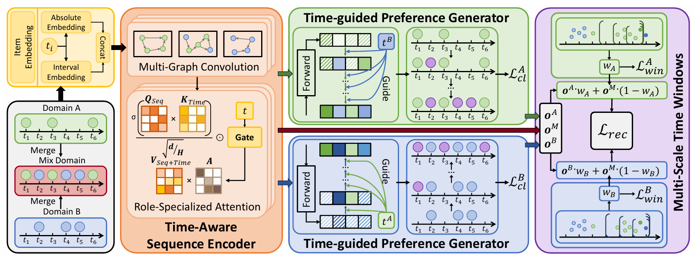

# Bridging Time and Domains: A Time-aware Framework for Cross-Domain Sequential Recommendation

Here is the official PyTorch implementation for the paper **"Bridging Time and Domains: A Time-aware Framework for Cross-Domain Sequential Recommendation"**, which has been accepted by **WWW '26**.

For more details, please refer to [https://dl.acm.org/doi/10.1145/3774904.3792249](https://dl.acm.org/doi/10.1145/3774904.3792249)

This project proposes a novel framework **TA-CDSR** to address the limitations of existing cross-domain sequential recommendation methods: (i) **assuming uniformly distributed interactions over time**; and (ii) **neglecting temporal influences during cross-domain transfer**. TA-CDSR incorporates a **time-aware sequence encoder** to capture evolving user preferences, and introduces a **time-guided preference generator** to reconstruct sparse interactions in the target domain. Moreover, a **multi-scale time-window based transfer module** is designed to adaptively weight cross-domain information.

**Authors**: Zemu Liu, Zhida Qin, Pengzhan Zhou, Tianyu Huang, and Gangyi Ding. 

**Affiliation**: Beijing Institute of Technology, Chongqing University.

## Architecture

The overall architecture of TA-CDSR consists of three main parts: **Time-Aware Sequence Encoder**, **Time-guided Preference Generator** and **Multi-Scale Time Windows Based Domain Transfer**



## Requirements

The code is implemented using **PyTorch**. The mainly required packages are listed below:

```
Python = 3.7.9
PyTorch = 1.10.1
Scipy = 1.7.3
Numpy = 1.21.6
```

## Train

The dataset link is [Google Drive](https://drive.google.com/drive/folders/13FMF1-x_6OsmQbwSBG3oSef3UvJ0Zk79). You can download the datasets, unzip them and place them in the `dataset` directory.

You can train **TA-CDSR** through the following commands.

```
CUDA_VISIBLE_DEVICES=0 python train_rec.py --data_dir Food-Kitchen
```

## Reference

If you find this repo helpful to your research, please cite our paper:

```
@inproceedings{ta-cdsr,
  title={Bridging Time and Domains: A Time-aware Framework for Cross-Domain Sequential Recommendation},
  author={Zemu Liu, Zhida Qin, Pengzhan Zhou, Tianyu Huang, and Gangyi Ding},
  booktitle={Proceedings of the ACM Web Conference 2026},
}
```

